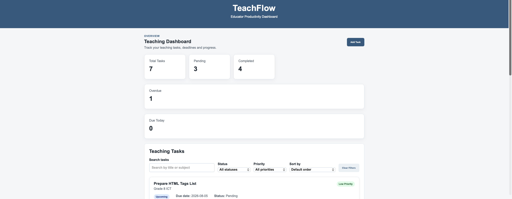
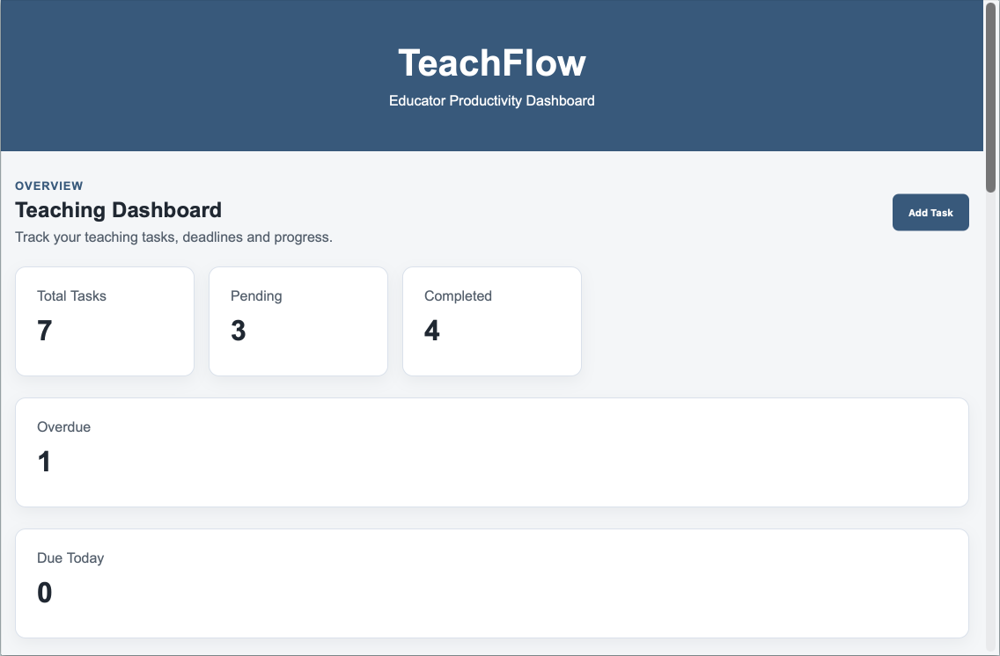
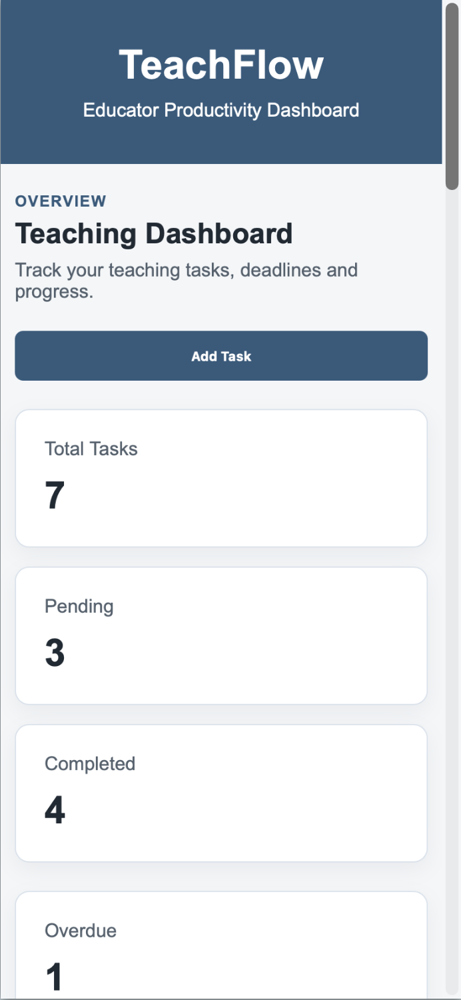

# TeachFlow

TeachFlow is a responsive educator productivity dashboard built with HTML, CSS and JavaScript.

It helps teachers manage classroom tasks, deadlines, priorities and progress from one simple dashboard.

## Live Demo

Live demo coming soon.

## Screenshots

### Desktop View



### Tablet View



### Mobile View



## Features

- Add teaching tasks
- Edit existing tasks
- Delete tasks
- Mark tasks as pending or completed
- Save tasks using localStorage
- Search by task title or subject
- Filter by status
- Filter by priority
- Sort by due date
- Sort by priority
- Overdue task detection
- Due Today and Upcoming indicators
- Dashboard statistics
- Responsive desktop, tablet and mobile layouts

## Dashboard Statistics

TeachFlow displays:

- Total tasks
- Pending tasks
- Completed tasks
- Overdue tasks
- Tasks due today

## Technologies Used

- HTML5
- CSS3
- JavaScript
- Local Storage
- Git
- GitHub
- VS Code

## How to Run Locally

1. Clone the repository

```bash

git clone https://github.com/komalramani/teachflow.git

```

2. Open the project folder.

3. Open `index.html` in your browser

OR

Use the **Live Server** extension in VS Code.

No installation or dependencies are required.

## Project Structure

```
teachflow/
│
├── index.html      # Dashboard layout and HTML structure
├── styles.css      # Responsive styling and UI components
├── script.js       # Task CRUD operations, filtering, sorting, and     dashboard updates
└── README.md       # Project documentation
```

## Key Skills Demonstrated

- HTML5 semantic structure
- CSS Flexbox and responsive design
- JavaScript DOM manipulation
- CRUD functionality
- Event handling
- Filtering and sorting data
- Git & GitHub version control
- Responsive mobile-first development

## Future Improvements
- Dark mode
- Task categories
- Progress charts
- Export tasks to CSV/PDF
- User accounts & cloud storage
- React version
- Backend integration

## Author

**Komal Ramani**

PhD in Computer Science

Front-End Web Developer with a strong foundation in problem-solving, responsive web design, and JavaScript. Former ICT educator with experience creating engaging learning experiences, now focused on building modern, user-friendly web applications.

- GitHub: [github.com/komalramani](https://github.com/komalramani)
- LinkedIn: [linkedin.com/in/komal-ramani-27255389](https://www.linkedin.com/in/komal-ramani-227255389/)